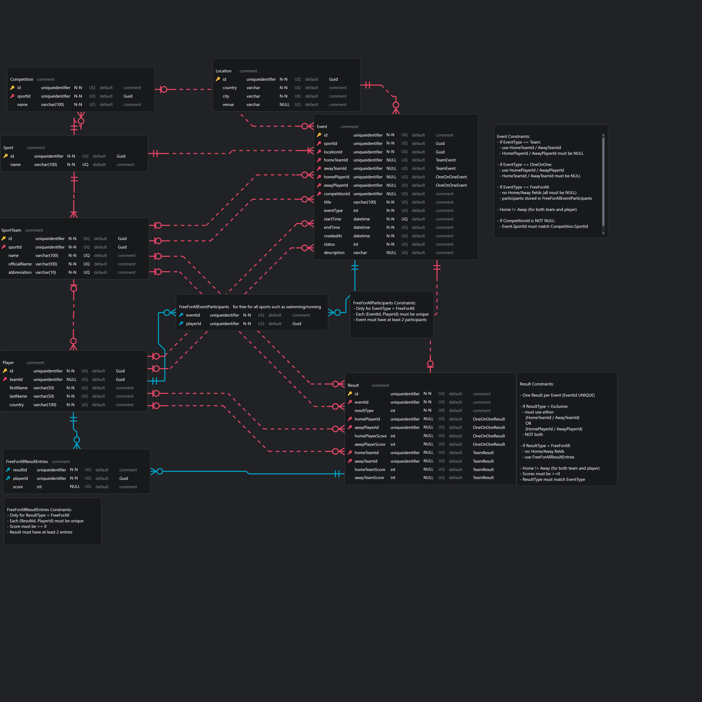
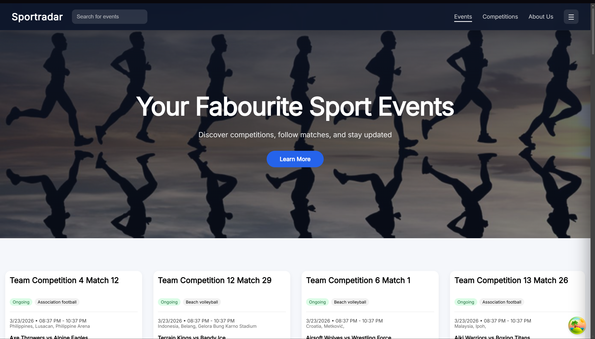
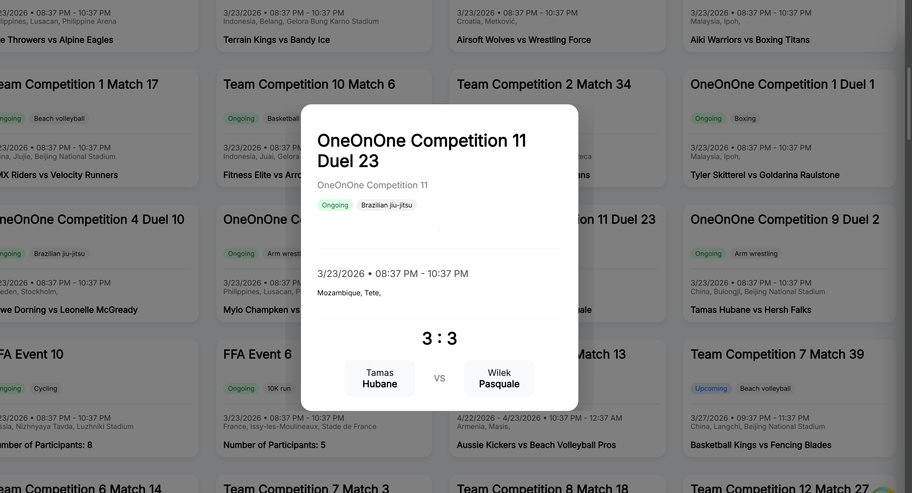
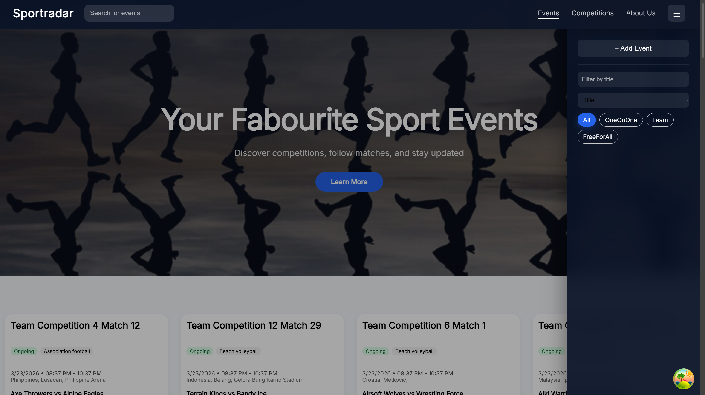

# Sportradar Coding Exercise (Backend)

***

## Overview

This project is a fullstack implementation of a sports event calendar, developed as part of the Sportradar Coding Academy backend exercise.

The application focuses on storing, retrieving, and managing sports events using a relational database, with a strong emphasis on proper data modeling and backend design.

The main goal of this solution is to demonstrate understanding of:
- relational database design
- efficient data handling
- backend architecture

***

## Approach

The solution was designed with a focus on **data consistency, extensibility, and clear separation of responsibilities**.

Instead of modeling all data in a single structure, the domain was decomposed into multiple related entities, following principles close to **Third Normal Form (3NF)**.

### Database Design

## Database Schema

The database is centered around the **Event** entity, which represents a scheduled sports event.

Key design decisions:
- Sports are stored separately to avoid duplication
- Participants (teams/players) are modeled independently
- Events are linked to participants through relationships
- Additional entities (e.g., location, competition) are separated to keep the schema extensible

### Inheritance Strategy (TPH)

For handling different types of participants (e.g., teams vs players), a **Table Per Hierarchy (TPH)** strategy is used.

This means:
- a single table stores multiple related entity types
- a discriminator column identifies the specific type

This approach was chosen because:
- it simplifies queries
- avoids excessive joins
- keeps the model flexible for future extensions

### Events and Results Separation

Events are modeled independently from their results.

This allows:
- creating events before results are known
- updating results without modifying event structure
- extending result logic (scores, status, statistics) without redesigning the schema

This reflects real-world behavior where:
- events exist before they are played
- results are added afterwards

### Relationships

- An event belongs to one sport
- An event can have multiple participants
- Participants can appear in multiple events
- Events can optionally be linked to additional contextual data (e.g., location)

Foreign keys are used to ensure referential integrity and enforce relationships between entities.

***

## Backend Implementation

The backend is implemented using ASP.NET Core and Entity Framework Core.

Key features:
- REST API for managing events
- Efficient data retrieval (avoiding queries inside loops)
- Proper use of relationships and navigation properties
- Database initialization using EF Core migrations

On application startup:
- the database is created automatically if it does not exist
- migrations are applied
- seed data is inserted

***

## Frontend

The frontend is implemented using React (Vite) and is used to:
- display events
- interact with the backend API

The focus is on functionality and integration rather than advanced UI.

***

## Technologies Used

- ASP.NET Core (.NET)
- Entity Framework Core
- SQL Server
- React (Vite)
- Docker & Docker Compose

***
## Application Preview

***

### Requirements
- Docker Desktop (must be installed and running)

### Setup

1. Start Docker Desktop  
   Ensure Docker Desktop is running before executing any commands.

2. Clone the repository
   git clone <repository-url>
   cd Sportradar

3. Create a `.env` file in the root directory with:
   SA_PASSWORD=YourStrong!Passw0rd

4. Start the application:
   docker compose up --build

After startup:
- Frontend: http://localhost:3000
- Backend (Swagger): http://localhost:8080/swagger

***

## Project Structure

Sportradar/
├── Sportradar.Backend/
├── Sportradar.Core/
├── Sportradar.Infrastructure/
├── Sportradar.Frontend/
├── docker-compose.yml
└── README.md

***

## Assumptions and Decisions

- A relational database was chosen to ensure structured and consistent data
- TPH inheritance was used to simplify polymorphic data handling
- Events and results were separated to reflect real-world lifecycle of data
- Backend logic prioritizes clarity and correctness over premature optimization
- Docker was used to ensure consistent setup across environments

***

## Future Improvements

- Filtering events by sport and date
- Adding authentication and authorization
- Extending result modeling (detailed statistics)
- Improving frontend UI and UX
- Adding automated tests

***

## Author

Marcin Vu Van
